# Class Diagram & Object-Oriented Design

This document details the class architecture, interfaces, associations, and design patterns of the **Inventory & Sales Management System**.

---

## 1. High-Level Class Diagram (Mermaid)

```mermaid
classDiagram
    %% Repositories and Interfaces
    class CrudRepository~T, ID~ {
        <<interface>>
        +save(entity: T) boolean
        +findById(id: ID) Optional~T~
        +findAll() List~T~
        +update(entity: T) boolean
        +deleteById(id: ID) boolean
        +existsById(id: ID) boolean
    }

    class UserRepository {
        -String filePath
        +findByUsername(username: String) Optional~User~
    }

    class ProductRepository {
        -String filePath
        +findByCategory(category: String) List~Product~
    }

    class SupplierRepository {
        -String filePath
    }

    class CustomerRepository {
        -String filePath
        +findByPhone(phone: String) Optional~Customer~
    }

    class SaleRepository {
        -String filePath
        +findByCustomerId(customerId: String) List~Sale~
    }

    CrudRepository <|.. UserRepository
    CrudRepository <|.. ProductRepository
    CrudRepository <|.. SupplierRepository
    CrudRepository <|.. CustomerRepository
    CrudRepository <|.. SaleRepository

    %% Models
    class User {
        -String userId
        -String username
        -String password
        -UserRole role
        +getRole() UserRole
    }

    class Product {
        -String productId
        -String name
        -String category
        -double price
        -int quantity
        -int minStockThreshold
        -String supplierId
        +getStockStatus() StockStatus
    }

    class Customer {
        -String customerId
        -String name
        -String phone
        -String email
        -String address
    }

    class Supplier {
        -String supplierId
        -String name
        -String contactPerson
        -String phone
        -String email
        -String address
    }

    class Sale {
        -String saleId
        -String customerId
        -LocalDateTime saleDate
        -List~SaleItem~ items
        -double totalAmount
        -PaymentMethod paymentMethod
        +calculateTotal() double
    }

    class SaleItem {
        -String productId
        -String productName
        -int quantity
        -double unitPrice
        +getSubtotal() double
    }

    Sale "1" *-- "1..*" SaleItem : contains
    Product "0..*" --> "1" Supplier : supplied by
    Sale "0..*" --> "0..1" Customer : billed to

    %% Enums
    class UserRole {
        <<enumeration>>
        ADMIN
        CASHIER
    }

    class StockStatus {
        <<enumeration>>
        IN_STOCK
        LOW_STOCK
        OUT_OF_STOCK
    }

    class PaymentMethod {
        <<enumeration>>
        CASH
        CARD
        UPI
        NET_BANKING
    }

    User --> UserRole
    Product --> StockStatus
    Sale --> PaymentMethod

    %% Services
    class AuthenticationService {
        -UserRepository userRepository
        -User currentUser
        +login(username, password) User
        +logout() void
        +getCurrentUser() User
        +hasRole(role) boolean
    }

    class ProductService {
        -ProductRepository productRepository
        -SupplierRepository supplierRepository
        +addProduct(product) Product
        +updateProduct(product) boolean
        +deleteProduct(productId) boolean
        +getProductById(productId) Product
        +searchProducts(query) List~Product~
    }

    class InventoryService {
        -ProductRepository productRepository
        +increaseStock(productId, qty) boolean
        +decreaseStock(productId, qty) boolean
        +getStock(productId) Product
        +getLowStockProducts() List~Product~
    }

    class SalesService {
        -SaleRepository saleRepository
        -ProductRepository productRepository
        -CustomerRepository customerRepository
        -InventoryService inventoryService
        +processSale(sale) Sale
        +getAllSales() List~Sale~
        +getTotalRevenue() double
    }

    SalesService --> InventoryService
    SalesService --> SaleRepository
    SalesService --> ProductRepository
    SalesService --> CustomerRepository
    ProductService --> ProductRepository
    InventoryService --> ProductRepository
    AuthenticationService --> UserRepository
```

---

## 2. Core OOP Principles Applied

1. **Encapsulation**:
   - All domain entity fields are private.
   - Access is mediated through validated getters and setters.
   - State integrity is protected through defensive copying (`new ArrayList<>(items)` in `Sale`).

2. **Abstraction**:
   - The generic `CrudRepository<T, ID>` interface abstracts storage operations from business logic.
   - Services interact with repositories through clean interfaces without knowing underlying text file mechanisms.

3. **Polymorphism**:
   - All repository implementations adhere to the common `CrudRepository` contract.
   - Enums (`StockStatus`, `UserRole`, `PaymentMethod`) provide type-safe dispatching.

4. **Exception Handling & Robustness**:
   - Clear custom domain exceptions (`ValidationException`, `ProductNotFoundException`, `InsufficientStockException`) prevent corrupt system states.
   - Centralized `InputValidator` standardizes numeric parsing and string sanitization across all interactive console forms.
