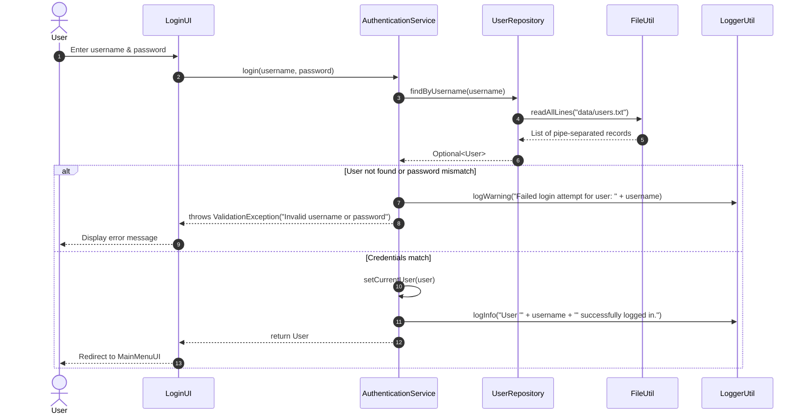
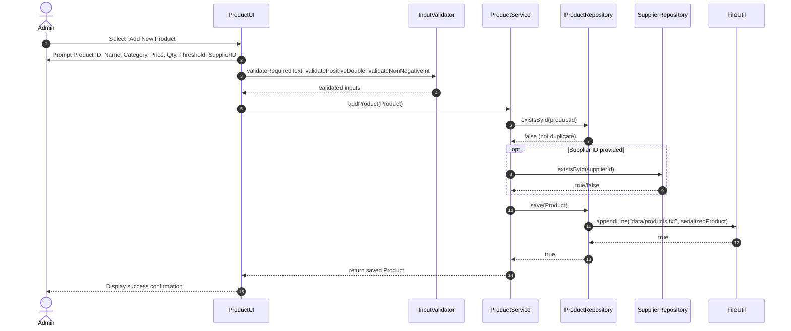
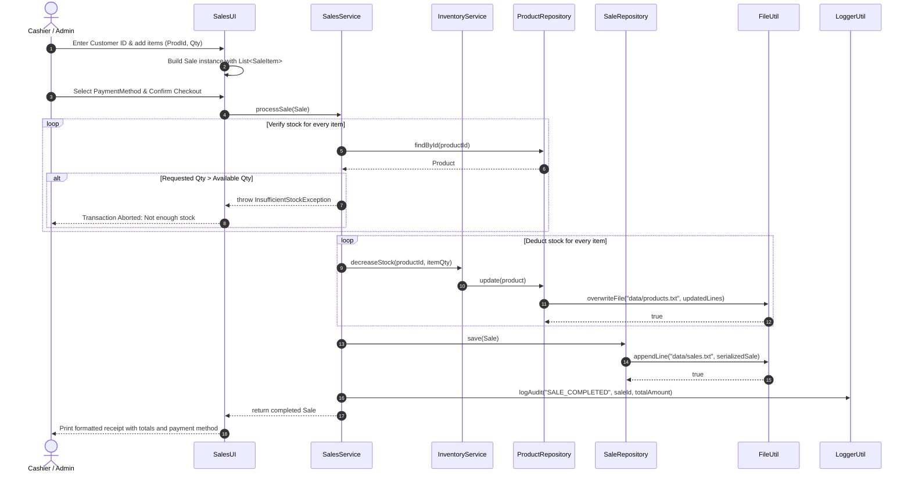

# Sequence Diagrams

This document illustrates the execution sequence, message passing, and lifecycle interactions across the system layers for critical use cases in the **Inventory & Sales Management System**.

---

## 1. User Authentication Sequence

---

## 2. Product Creation & Validation Sequence

---

## 3. End-to-End Sales Processing Sequence

