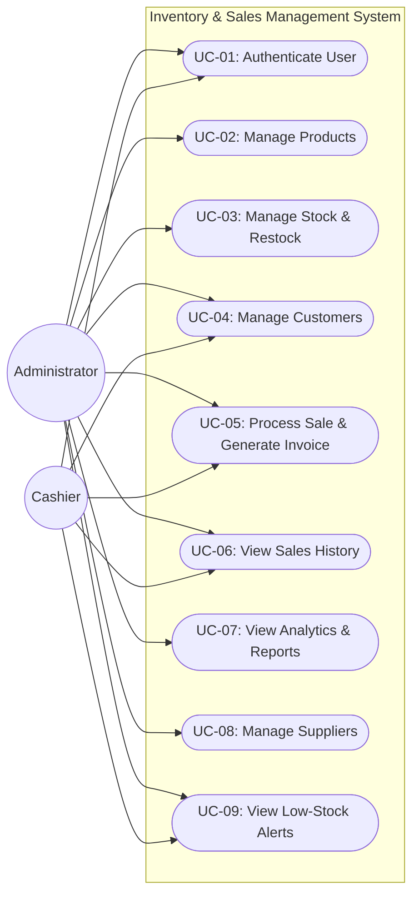

# Use Case Documentation

This document describes the primary actors, use cases, and interaction scenarios for the **Inventory & Sales Management System**.

---

## 1. Actors

| Actor | Description | Role Privilege |
|---|---|---|
| **Administrator (Admin)** | Store manager or system owner with full administrative authority over inventory, catalog, suppliers, users, and financial reports. | `UserRole.ADMIN` |
| **Cashier / Staff** | Front-desk operator responsible for processing sales, handling customer inquiries, checking stock availability, and creating customer records. | `UserRole.CASHIER` |

---

## 2. Use Case Diagram

---

## 3. Detailed Use Case Specifications

### UC-01: Authenticate User
* **Primary Actor**: Admin, Cashier
* **Precondition**: Application is launched and data files are accessible.
* **Main Success Scenario**:
  1. Actor enters username and password at prompt.
  2. System verifies credentials against `data/users.txt`.
  3. System assigns role-specific permissions and logs login event to `data/app.log`.
  4. System redirects actor to role-tailored Main Menu.
* **Alternative Scenario (3a)**: Credentials do not match. System displays error message, logs attempt, and prompts again.

---

### UC-02: Manage Products (CRUD)
* **Primary Actor**: Admin
* **Precondition**: Actor is authenticated as `ADMIN`.
* **Main Success Scenario**:
  1. Actor selects Product Management menu.
  2. Actor selects action: Add, View All, Search, Update, or Delete.
  3. For Add/Update: Actor inputs Product ID, Name, Category, Price, Quantity, Threshold, Supplier.
  4. System validates inputs (non-empty, positive price, non-negative quantities, no delimiter characters).
  5. System persists changes to `data/products.txt`.
* **Exceptions**: Duplicate ID throws `ValidationException`; Invalid numeric format displays user-friendly prompt to re-enter.

---

### UC-03: Manage Stock & Restock
* **Primary Actor**: Admin
* **Precondition**: Actor is authenticated.
* **Main Success Scenario**:
  1. Actor selects Restock option.
  2. Actor enters Product ID and quantity to add.
  3. System validates existence of Product ID and positive quantity.
  4. System increments product quantity in `data/products.txt` and recalculates stock status (`IN_STOCK`, `LOW_STOCK`, `OUT_OF_STOCK`).
  5. System outputs success confirmation with updated quantity.

---

### UC-05: Process Sale & Generate Invoice
* **Primary Actor**: Cashier, Admin
* **Precondition**: Products exist in inventory with available stock.
* **Main Success Scenario**:
  1. Actor initiates new sale.
  2. Actor enters Customer ID or leaves blank for Guest.
  3. Actor adds one or more items (Product ID and quantity).
  4. System verifies stock for each item, calculates subtotal, and updates cart total.
  5. Actor confirms cart and selects payment method (`CASH`, `UPI`, `CARD`, `NET_BANKING`).
  6. System commits transaction:
     - Deducts item quantities from `products.txt`.
     - Appends serialized sale record to `sales.txt`.
     - Logs audit trail in `data/app.log`.
  7. System renders formatted invoice receipt with sale details.
* **Alternative Scenario (4a - Insufficient Stock)**: If quantity requested exceeds stock, system throws `InsufficientStockException`, reports available quantity, and rejects item addition.

---

### UC-07: View Analytics & Reports
* **Primary Actor**: Admin
* **Precondition**: Actor is logged in as `ADMIN`.
* **Main Success Scenario**:
  1. Actor selects Reports & Analytics option.
  2. Actor selects desired report (Revenue Summary, Inventory Valuation, Low-Stock Warnings, Top Selling Products).
  3. System queries repositories, aggregates metrics, and formats tabular output.
