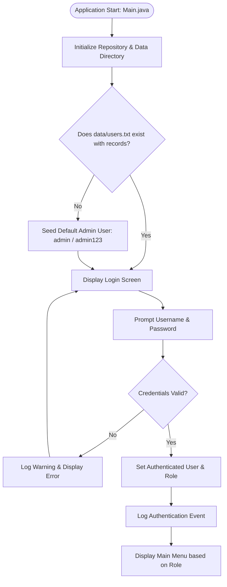
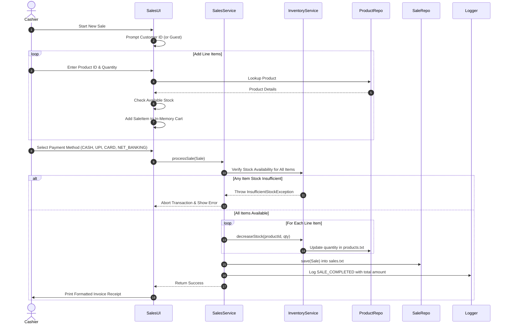

# System Workflow

This document details the primary runtime workflows and operational flowcharts of the **Inventory & Sales Management System**.

---

## 1. Application Lifecycle & Startup Workflow

---

## 2. Role-Based Navigation Workflow

Depending on the authenticated user's role, options are selectively displayed:

### Admin Workflow
1. **Product Management**: Add, View, Search, Update, or Delete products.
2. **Inventory Management**: Check Stock Levels, Restock (Increase Stock), Adjust Stock (Decrease Stock), View Low Stock Warnings.
3. **Customer Management**: Register Customer, View All, Search by Phone/Name.
4. **Sales & Billing**: Create New Sale, Process Checkout, View Sales History.
5. **Reports & Analytics**: Full Sales Summary, Inventory Valuation, Top Selling Products, Low-Stock Re-order List.
6. **System Logout / Exit**: Closes session or terminates application.

### Cashier Workflow
1. **Sales & Billing**: Initiate sale, scan/select product IDs, enter quantities, select payment method, generate invoice.
2. **Customer Management**: Look up existing customer or register new customer on the spot.
3. **Product & Stock Inquiry**: View current prices, check if product is `IN_STOCK`.
4. **System Logout / Exit**.

---

## 3. Sales & Checkout Workflow

The sales checkout is the central transactional process connecting multiple system layers:

---

## 4. Inventory Replenishment Workflow

1. **Manager/Admin chooses Restock Option**:
   - Prompts for `Product ID`.
   - Displays current stock and threshold.
   - Prompts for `Quantity to Add` (> 0).
2. **Validation**:
   - Verifies product exists in `ProductRepository`.
   - Confirms quantity is a valid positive integer.
3. **Atomic Persistence**:
   - Calls `InventoryService.increaseStock(id, qty)`.
   - Updates `products.txt`.
   - Automatically recomputes stock status (`OUT_OF_STOCK` -> `LOW_STOCK` -> `IN_STOCK`).
   - Logs stock adjustment event in `app.log`.

---

## 5. Graceful Termination Workflow

When the user selects **Exit** (Option 0):
1. Any active session is cleared.
2. Audit log records `APPLICATION_SHUTDOWN`.
3. Application exits cleanly with status code `0`.
